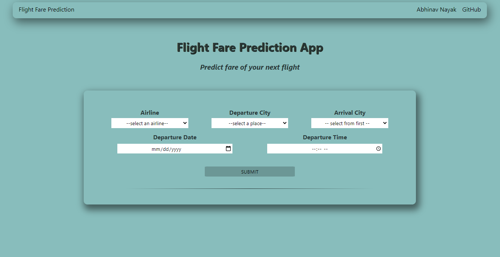
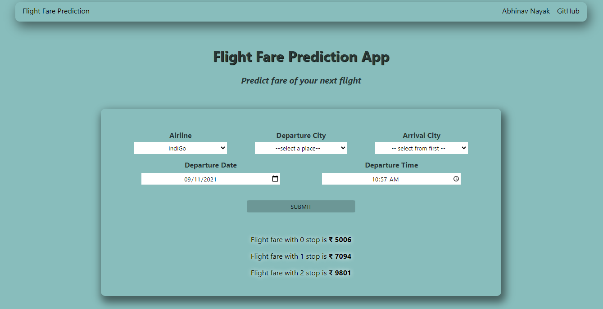

# [Flight Prediction](https://tinyurl.com/flight-fare-prediction)

## Table of Content
  * [Overview](#overview)
  * [Project Details](#project-details)
  * [Project Structure](#project-structure)
  * [Installation](#installation)
  * [Future scope](#future-scope)

## [Overview](#table-of-content)
This is an end-to-end Machine Learning Project. The working web [app](https://tinyurl.com/flight-fare-prediction) will predict the fare of your flight. It will ask the departure city, arrival city, departure date & time and total stops to predict the same.   

**<p align="center">Home Page</p>**



**<p align="center">Prediction Result</p>**



The primary goal of this project was to learn and implement an end-to-end ML project. After doing a few courses and participating in a few competitions I felt a need to do a project to understand how machine learning is used in application. With this project I got the oppurtunity to learn HTML, CSS, Bootstrap, Flask, Heroku.   

_**<ins>Disclaimer</ins>**_ : _To make the user input more intuitive I have omitted some features from the dataset (example:-Arrival date)._ _Hence, performance of the machine learning model was not the primary goal and there is a lot of [scope](#future-scope) of improvement for the project in this area._
_This [repo](https://github.com/analyticsindiamagazine/MachineHack/tree/master/Hackathon_Solutions/Predict%20The%20Flight%20Ticket%20Price%20Hackathon) has notebooks which have achieved very high performance._

## [Project Details](#table-of-content)
1. **Data Collection** : Flight dataset was taken from Machine Hack flight fare prediction hackathon. You can find the dataset [here](https://www.kaggle.com/nikhilmittal/flight-fare-prediction-mh). It is important to note here, the dataset has flight details for 4 months (from March 2019 to June 2019) only. 
2. **Data Cleaning & EDA** : The dataset is cleaned by handling null values, checking data types, removing outliers. Exploratory data analysis helped discover patterns in data. New features are created and unnecessary features are removed. Explained in this [notebook](https://github.com/abhinavnayak11/flight-prediction/blob/main/notebooks/Data_Cleaning.ipynb)
3. **Model training** : Dataset is prepared by encoding categorical data. Different Machine learning algorithms are trained on this dataset using the wonderful scikit-learn library. The best performing model was then further optimized with Hyperparameter tuning and saved using joblib. Explained in this [notebook](https://github.com/abhinavnayak11/flight-prediction/blob/main/notebooks/Modelling.ipynb). The final model has a r2 score of 0.8593965. There is [scope](#future-scope) for improvement here.
4. **Deployment** : Flask web framework in python was used to create the web application. The input data from user is encoded (encoding used in training is saved) and then fed into model to predict result. Flask code in `app.py`. Encoders and model is saved in `files` folder. Webpage HTML is present in `templates` folder and styling and scripts in `static` folder. After testing locally the project is deployed in Heroku.

## [Project Structure](#table-of-content)
```
├── files
│   ├── mappings.pkl
│   |__ model.pkl
├── notebooks
│   ├── Data_cleaning.ipynb
│   |__ Modelling.ipynb
├── static
│   ├── scripts.js
│   |__ styles.css
├── template
│   ├── api.html
├── Procfile
├── README.md
├── app.py
|__ requirements.txt
```

## [Installation](#table-of-content)
1. Install [Python](https://www.python.org/downloads/) & [git](https://git-scm.com/downloads)
2. (_You can skip this step_) Create virtual environment for this project. With virtual environement it is easier to maintain packages for each project. Tutorials : [Windows](https://www.youtube.com/watch?v=APOPm01BVrk) | [Mac&Linux](https://www.youtube.com/watch?v=Kg1Yvry_Ydk)
3. Create a new folder `project` locally
4. Open cmd and type `cd path/to/project`
5. `git clone https://github.com/abhinavnayak11/flight-prediction.git .` : This will clone this project repo into `project` folder locally
6. (_You can skip this step_) Activate the virtual environment.
7. `pip install -r requirements.txt` : This will install all the required libraries
8. `cd path/to/project`
9. `python -m app` : This will run the flask app
10. Navigate to `http://127.0.0.1:5000/` : Flask app in served here
11. To deploy in Heroku follow this [tutorial](https://www.youtube.com/watch?v=mrExsjcvF4o)

## [Future Scope](#table-of-content)
- The dataset used has flight details of only 4 months. Collection of more data spanning across years can help in better prediction
- Exploratory data analysis is never done enough. More analysis can present us with unseen patterns. 
- Currently 6 new features are created. More features can be created here. Some of them include distance between cities, Longitude & Latitude of city. Feature engineering along with proper feature selection methods will definitely help the model performance
- Varous ensembling methods can be used to increase the model performance.
